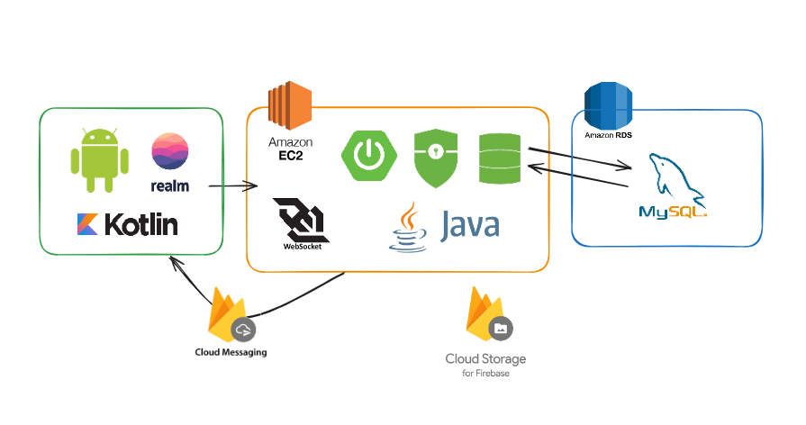

# Buddies

## AniBuddy

### 프로젝트 개요

---

- **진행기간** : 2024.07.28 ~ 2024.0827

- **개발 배경 및 목적**
  
  개발 배경
  
  - 농림축산식품부 조사 결과에 따르면 2023년 기준 국내 반려동물 양육 인구 비율이 28.2%로 거의 1/3에 해당하는 인구가 반려동물과 생활하는 것으로 확인되며, 2024년 기준으로 반려동물 1000만 마리가 넘어선 것으로 파악됨
  
  - 애완동물이 아닌 반려동물로서 가족이라는 인식 변화 및 급격한 반려동물 산업의 발전 진행 중
  
  - 기존 서비스 활용의 불편함보다 새로운 기술의 다양화만 보이는 문제점이 발생
  
  목적
  
  - 반려동물인과 행동교정사 및 애견 미용샵 간의 효율적인 연결 지원하는 모바일 서비스
  
  - 사용자의 입장에서 주변 및 원하는 지역의 행동교정사 및 애견 미용샵 정보 확인, 평점, 연락처, 위치 및 교정 후기 등을 기반으로 확인 가능
  
  - 행동교정사 및 애견 미용샵의 입장에서 업체 홍보 및 본인들의 정보를 노출하고 예약을 연동하여 효율적 예약 서비스 이용 가능

### 주요기능

---

### 기술 스택

---

- **Frontend** : Android Studio, Kotlin, Shared Preference

- **Backend** : Java, Spring Boot, JPA, JWT, Spring Security, WebSocket, FCM

- **DB** : MySQL, Firebase, Realm

- **CI/CD** : AWS EC2, AWS RDS, Firebase Storage

### 시스템 아키텍쳐

---

### 설계 산출물 및 관련 문서

---

##### 요구사항 정의

##### 화면설계서

##### ERD

.png)

### 팀원 소개

---

| 이세울(팀장,풀스택)                   | 양성대(풀스택)                         | 주효빈(풀스택)                  | 노하영(풀스택)                   |
| ----------------------------- | -------------------------------- | ------------------------- | -------------------------- |
| 풀스택 Auth 데이터 전처리  | 풀스택 프로필 및 애완동물 등록 팔로우 기능 | 풀스택 가게 상세 페이지 디자인 | 풀스택 Web Socket FCM |